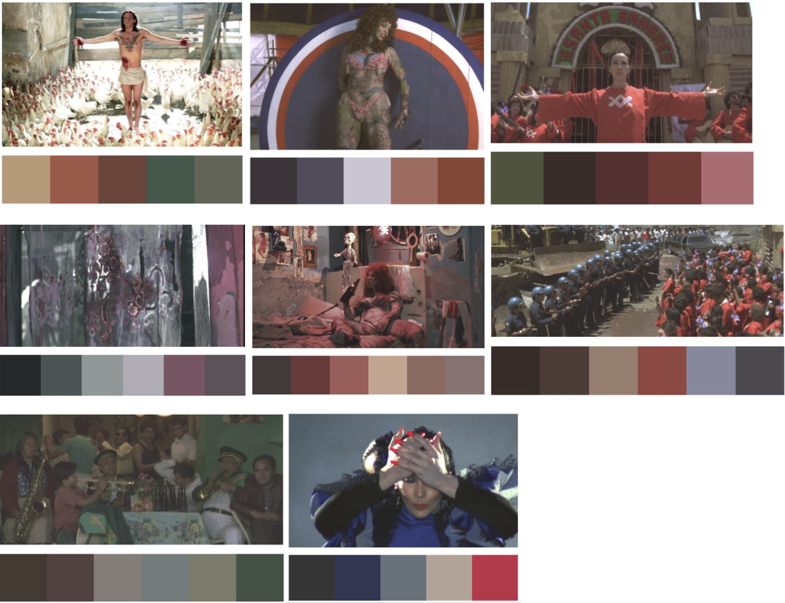

# JodorowskyPalette

Colour palettes from three of Alejandro Jodorowsky’s films: El Topo (4 palettes), Santa Sangre (8 palettes), and The Holy Mountain (7 palettes).

## Installation

``` r
install.packages("Jodorowsky")
```
## Usage

``` r
library("Jodorowsky")
holy_mountain(2)
[1] "#1E1F21" "#1B4557" "#2082A1" "#A12B37" "#7C1418"
el_topo(2)
[1] "#65D5EB" "#64BD8E" "#BCCDA3" "#576645" "#28201D"
santa_sangre(2)
[1] "#3B3237" "#504B59" "#CEC5D4" "#AB6D5E" "#924735"

# Plot the first of the Holy Mountain palettes:
for (j in 1:5)
 {
 	plot(j,1,col=holy_mountain(1)[j], pch=16, cex=20, xlim=c(0,6), xlab="", ylab="", xaxt="n", yaxt="n", bty="n", main=paste("holy_mountain ",1))
 	par(new=TRUE)
 }

```


# Palettes

## El Topo


## The Holy Mountain


## Santa Sangre



# Blend colours

You can create a blend of the palette colours using:

``` r

colfunc <- colorRampPalette(holy_mountain(1))
colrange = colfunc(50);

for (j in 1:50)
{
	plot(j,1,col= colrange[j], pch=16, cex=2, ylim = c(0.9,1.1),xlim=c(0,51), xlab="", ylab="", xaxt="n", yaxt="n", bty="n", main=paste("holy_mountain ",1))
	par(new=TRUE)
}
```
In this example I have using the 1st Holy Mountain palette.

